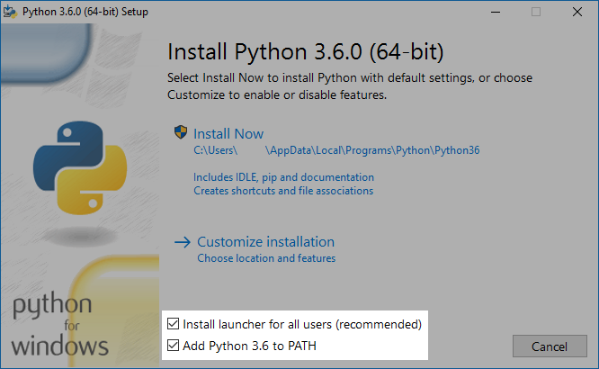

# Instalace (domácí příprava) – Windows

Pro ušetření času na workshopu tě prosíme, aby sis předem
nainstalovala na počítač, který budeš na workshopu používat,
potřebné programy.

Kdyby se ti to nepovedlo, nebo kdybys měla nějaké otázky,
dej vědět – rádi poradíme podrobněji.
Tohle není zkouška tvých schopností :)

## Instalace Pythonu

Běž na [stahovací stránku Pythonu 3.6.4](https://www.python.org/downloads/release/python-364/).
Na ní dole uvidíš seznam souborů ke stažení.

Vyber *Windows x86-64 executable installer*, stáhni ho a spusť.
(Pokud nejde spustit, použij místo něj *Windows x86 executable installer*.)

Na začátku instalace zaškrtni **Install launcher for all Users**
a také **Add Python 3.6 to PATH**:

(Jestli nemáš administrátorské oprávnění, volbu
*Install launcher for all Users* nezaškrtávej.)

Pak zmáčkni Install now a dále se drž instrukcí.

## Instalace editoru

Druhý program, který budeme potřebovat, je programátorský editor.
Pro novější počítače doporučujeme modernější *Atom*, pro pomalejší
laptopy pak *Notepad++*, který nezabírá tolik prostředků.
(Pokud už nějaký programátorký editor máš a používáš, instalaci přeskoč.)

* Atom si stáhni z jeho [domovské stránky](https://atom.io/) a nainstaluj.

* Notepad++ si stáhni z jeho
  [domovské stránky](https://notepad-plus-plus.org/) a nainstaluj.
  Pak ho spusť a v menu *Nastavení* zvol *Předvolby* a pak nastav
  „Nastavení tabulátoru“ (Tab Settings) na
  „Zaměnit za mezery“ (Replace by Space).

## Zpětná vazba

Až budeš mít hotovo, ozvi se prosím organizátorce.
Napiš že máš Windows a sděl který editor používáš.
